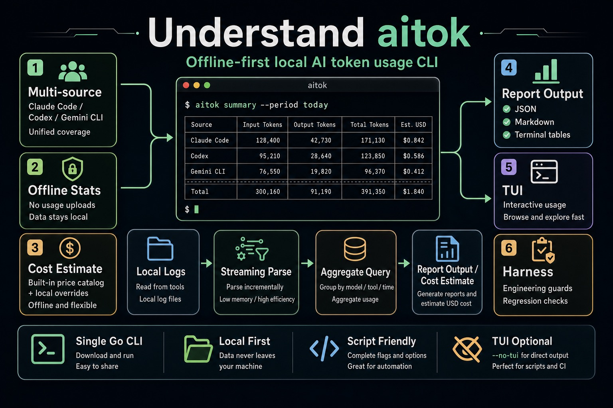

# aitok

[中文](README.zh-CN.md)



`aitok` is a lightweight offline CLI for summarizing local token usage from Claude Code, Codex, and Gemini CLI.

It does not upload data or read API keys. Usage and USD cost summaries are built from local tool logs.

## Install

Homebrew:

```bash
brew tap MagnumGoYB/aitok
brew install --cask aitok
```

The tap step keeps the install command short and avoids the less readable fully qualified cask name.

Go:

```bash
go install github.com/MagnumGoYB/aitok/cmd/aitok@latest
```

For local development:

```bash
go install ./cmd/aitok
```

`aitok` checks GitHub release metadata at most once every 24 hours before a command runs. If a newer version exists, it prints an upgrade prompt to stderr based on the detected install method. The check does not upload usage data, does not read logs, and can be skipped with `--no-version-check` or `AITOK_NO_VERSION_CHECK=1`.

## Usage

```bash
aitok summary --period today
aitok summary --period today --threads --format json
aitok summary --period this-week --group-by tool,model,provider --format markdown
aitok report --period last-week --format json
aitok tui
aitok tui --lang zh-CN
aitok doctor
aitok version
aitok -v
aitok update
aitok setup gemini --dry-run
aitok pricing audit --period this-month --format markdown
aitok budget check --period this-month --limit-usd 20 --group-by tool,model,cwd
```

## AI Agent Invocation

AI agents and scripts should prefer JSON output and skip the low-frequency version check:

```bash
aitok --no-version-check summary --period today --format json
aitok --no-version-check summary --period today --threads --format json
aitok --no-version-check pricing audit --period this-month --format json
aitok --no-version-check doctor --format json
aitok --no-version-check budget check --period this-month --limit-usd 20 --format json
```

For JSON commands, stdout is reserved for the structured payload. Warnings, version prompts, and budget failure summaries are written to stderr or returned through the process exit status. `budget check` exits with status `1` when the limit is exceeded but still writes the full JSON payload to stdout for parsing.

The TUI uses English by default. Pass `--lang zh-CN` to start in Chinese, or press `l` inside the TUI to switch languages. Model Usage and Threads sort by descending token usage by default; pass `--sort cost` for cost ordering, or press `s` inside the TUI to switch between Tokens and Cost. When threads are present, use `j/k` or arrow keys to move the selected row, `home/end` to jump, and `c` to copy the selected thread ID through OSC52.

`aitok update` checks the latest GitHub Release immediately and runs the matching local upgrade command when the install method supports it. Homebrew installs use `brew update && brew upgrade --cask aitok`; Go installs use `go install github.com/MagnumGoYB/aitok/cmd/aitok@latest`. Direct release binaries print the download URL.

Periods:

- `today`
- `yesterday`
- `this-week`
- `last-week`
- `this-month`

Filters:

- `--tool claude|codex|gemini`
- `--model <name>`
- `--provider <provider-or-auth-type>`
- `--cwd <path-fragment>`

Grouping:

```bash
--group-by tool,model,provider,day,cwd
```

Reports include request count, token totals, cache tokens, and estimated USD cost. Cost uses an offline default model price catalog based on an official public pricing snapshot and can be overridden locally:

To include matching local sessions in the summary payload, pass `--threads`:

```bash
aitok summary --period today --threads --format json
```

Thread rows include ID, name, tool, model, provider, token usage, requests, events, source, and estimated USD cost. Query output sorts by descending token usage unless `--sort cost` is passed. The title comes from local logs only, preferring custom title, AI summary title, first real user message, cwd basename, then short ID.

```json
{
  "models": [
    {
      "match": "gpt-5.4",
      "input_usd_per_mtok": 1.25,
      "output_usd_per_mtok": 10,
      "cache_hit_usd_per_mtok": 0.125,
      "cache_make_usd_per_mtok": 1.25,
      "multiplier": 1
    }
  ]
}
```

Save this as `~/.aitok/pricing.json`, or pass a file explicitly:

```bash
aitok summary --pricing ./pricing.json --format json
```

Prices are USD per 1M tokens. Reasoning tokens are charged as output tokens. `multiplier` defaults to `1`.

To check whether local usage contains models that are not covered by the offline catalog or your override file:

```bash
aitok pricing audit --period this-month --format json
```

The audit stays offline and prints unmatched `tool/model/provider` groups plus a `pricing.json` skeleton that can be copied into `~/.aitok/pricing.json`.

To enforce a local budget in scripts or CI:

```bash
aitok budget check --period this-month --limit-usd 20
```

The command exits with status `0` when the estimated cost is within the limit and status `1` when the estimate exceeds the limit. If some events do not match a price, the report includes a warning because the estimate may be low.

`aitok doctor` also reports source event counts, latest event timestamps, Gemini local telemetry safety, and pricing coverage.

## Data Sources

- Claude Code: `~/.claude/projects/**/*.jsonl`
- Codex: `~/.codex/sessions/**/*.jsonl`
- Gemini CLI: local telemetry outfile configured in `~/.gemini/settings.json`

Gemini CLI telemetry is disabled by default. Run:

```bash
aitok setup gemini
```

This configures local telemetry output and sets `logPrompts=false` so prompts are not recorded in telemetry.

## Development

```bash
make setup
make check
make test
make test-harness
make vet
make build
make validate
make validate-pr-body
```

`make setup` enables the repository commit-msg hook for local commitlint. Harness and AI agent constraints live in `AGENTS.md`, `AGENTS.zh-CN.md`, and `docs/harness-engineering.md`.

## Open Source Flow

- Contributing guide: `CONTRIBUTING.md` / `CONTRIBUTING.zh-CN.md`
- Security policy: `SECURITY.md` / `SECURITY.zh-CN.md`
- GitHub automation: `docs/github-automation.md` / `docs/zh-CN/github-automation.md`
- Code of Conduct: `CODE_OF_CONDUCT.md` / `CODE_OF_CONDUCT.zh-CN.md`
- Support: `SUPPORT.md` / `SUPPORT.zh-CN.md`
- License: MIT
