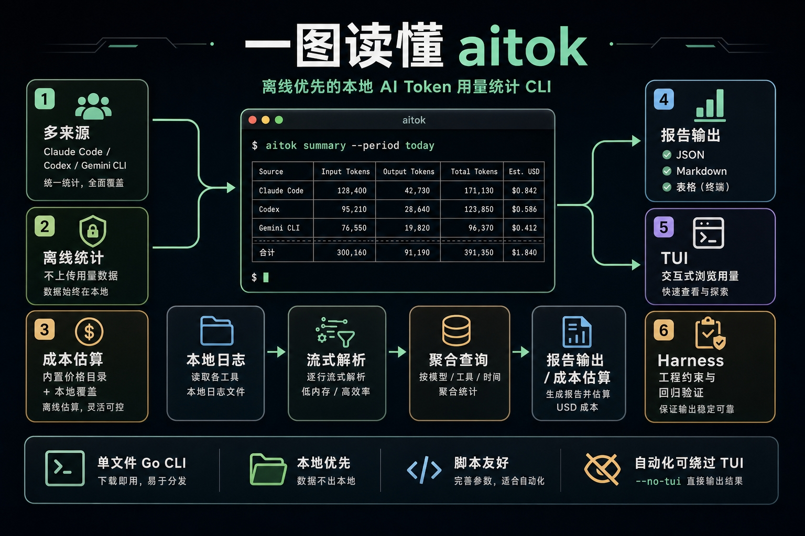

# aitok

[English](README.md)



`aitok` 是一个轻量、离线优先的 CLI，用于统计本机 Claude Code、Codex 和 Gemini CLI 的 Token 用量。

它不会上传数据或读取 API Key。用量和 USD 成本统计都来自本机工具日志。

## 安装

Homebrew：

```bash
brew tap MagnumGoYB/aitok
brew install --cask aitok
```

先执行 tap 可以保持安装命令简洁，避免使用较不规范的完整 cask 名称。

Go：

```bash
go install github.com/MagnumGoYB/aitok/cmd/aitok@latest
```

本地开发：

```bash
go install ./cmd/aitok
```

`aitok` 会在命令执行前最多每 24 小时检查一次 GitHub release 元数据。如果发现新版本，会根据检测到的安装方式把升级提示输出到 stderr。该检查不会上传用量数据，不会读取日志，也可以通过 `--no-version-check` 或 `AITOK_NO_VERSION_CHECK=1` 跳过。

## 使用

```bash
aitok summary --period today
aitok summary --period today --threads --format json
aitok summary --period this-week --group-by tool,model,provider --format markdown
aitok report --period last-week --format json
aitok tui
aitok tui --lang zh-CN
aitok doctor
aitok version
aitok -v
aitok update
aitok setup gemini --dry-run
aitok pricing audit --period this-month --format markdown
aitok budget check --period this-month --limit-usd 20 --group-by tool,model,cwd
```

## AI Agent 调用

AI Agent 和脚本应优先使用 JSON 输出，并跳过低频版本检查：

```bash
aitok --no-version-check summary --period today --format json
aitok --no-version-check summary --period today --threads --format json
aitok --no-version-check pricing audit --period this-month --format json
aitok --no-version-check doctor --format json
aitok --no-version-check budget check --period this-month --limit-usd 20 --format json
```

对于 JSON 命令，stdout 只承载结构化 payload。warning、版本提示和预算失败摘要写入 stderr，或通过进程退出状态表达。`budget check` 超过限制时返回状态码 `1`，但仍会把完整 JSON payload 写入 stdout，便于 Agent 解析。

TUI 默认使用英文文案。传入 `--lang zh-CN` 可默认显示中文，也可以在 TUI 中按 `l` 切换语言。Model Usage 和 Threads 默认按 token 用量降序排列；传入 `--sort cost` 可按成本排序，也可以在 TUI 中按 `s` 在 Tokens 和 Cost 之间切换。当存在 threads 时，使用 `j/k` 或方向键移动选中行，`home/end` 跳转首尾，`c` 通过 OSC52 复制选中的 thread ID。

`aitok update` 会立即检查最新 GitHub Release，并在当前安装方式支持时执行对应的本地升级命令。Homebrew 安装会使用 `brew update && brew upgrade --cask aitok`；Go 安装会使用 `go install github.com/MagnumGoYB/aitok/cmd/aitok@latest`。直接下载的 release 二进制会打印下载地址。

时间范围：

- `today`
- `yesterday`
- `this-week`
- `last-week`
- `this-month`

过滤条件：

- `--tool claude|codex|gemini`
- `--model <name>`
- `--provider <provider-or-auth-type>`
- `--cwd <path-fragment>`

分组：

```bash
--group-by tool,model,provider,day,cwd
```

报告会返回请求数量、Token 总量、缓存 Token 和预估 USD 成本。若需要在 summary payload 中包含匹配的本机会话列表，传入 `--threads`：

```bash
aitok summary --period today --threads --format json
```

Thread 行包含 ID、名称、tool、model、provider、Token 用量、requests、events、source 和预估 USD 成本。查询输出默认按 token 用量降序排列，传入 `--sort cost` 后按成本降序排列。标题只读取本地日志，优先级为 custom title、AI 总结标题、首条真实用户消息、cwd basename、short ID。

成本默认使用基于官方公开价格快照的离线 model 价格表，也支持本地覆盖：

```json
{
  "models": [
    {
      "match": "gpt-5.4",
      "input_usd_per_mtok": 1.25,
      "output_usd_per_mtok": 10,
      "cache_hit_usd_per_mtok": 0.125,
      "cache_make_usd_per_mtok": 1.25,
      "multiplier": 1
    }
  ]
}
```

保存为 `~/.aitok/pricing.json`，或通过参数显式指定：

```bash
aitok summary --pricing ./pricing.json --format json
```

价格单位是 USD / 1M tokens。Reasoning tokens 按 output tokens 计费。`multiplier` 默认是 `1`。

如需检查本地用量中是否存在离线价格表或本地覆盖文件无法匹配的模型：

```bash
aitok pricing audit --period this-month --format json
```

该审计保持离线运行，会输出未匹配的 `tool/model/provider` 分组，并生成可复制到 `~/.aitok/pricing.json` 的价格 skeleton。

如需在脚本或 CI 中检查本地预算：

```bash
aitok budget check --period this-month --limit-usd 20
```

当预估成本未超过限制时命令返回状态码 `0`，超过限制时返回状态码 `1`。如果部分事件没有匹配价格，报告会提示预估成本可能偏低。

`aitok doctor` 也会报告数据源事件数、最近事件时间、Gemini 本地 telemetry 安全状态和价格覆盖率。

## 数据源

- Claude Code：`~/.claude/projects/**/*.jsonl`
- Codex：`~/.codex/sessions/**/*.jsonl`
- Gemini CLI：`~/.gemini/settings.json` 中配置的本地 telemetry outfile

Gemini CLI 默认关闭 telemetry。运行：

```bash
aitok setup gemini
```

该命令会配置本地 telemetry 输出，并设置 `logPrompts=false`，避免在 telemetry 中记录 prompt。

## 开发

```bash
make setup
make check
make test
make test-harness
make vet
make build
make validate
make validate-pr-body
```

`make setup` 会启用仓库的 commit-msg hook，用于本地 commitlint。Harness 和 AI agent 约束见 `AGENTS.md`、`AGENTS.zh-CN.md`、`docs/harness-engineering.md` 和 `docs/zh-CN/harness-engineering.md`。

## 开源流程

- 贡献指南：`CONTRIBUTING.md` / `CONTRIBUTING.zh-CN.md`
- 安全策略：`SECURITY.md` / `SECURITY.zh-CN.md`
- GitHub 自动化：`docs/github-automation.md` / `docs/zh-CN/github-automation.md`
- 行为准则：`CODE_OF_CONDUCT.md` / `CODE_OF_CONDUCT.zh-CN.md`
- 支持说明：`SUPPORT.md` / `SUPPORT.zh-CN.md`
- License：MIT
